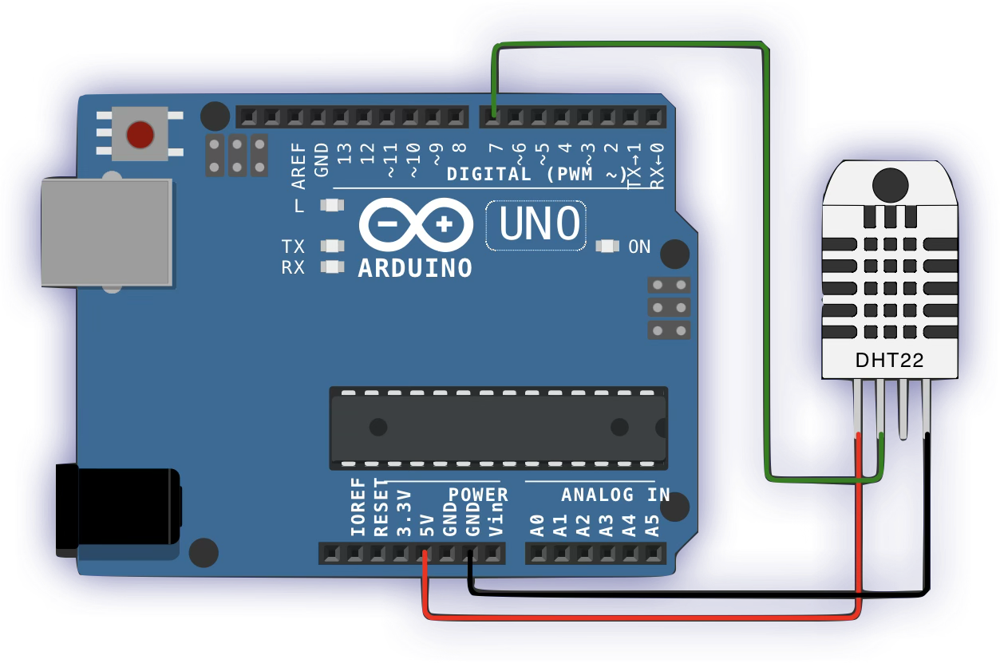

# IoT Temperature Monitoring

This project is an IoT-based temperature monitoring system that reads temperature data from a **DHT22** sensor and sends it to a remote server using **ESP8266** over a Wi-Fi connection. The data is transmitted via HTTP `POST` requests, enabling remote monitoring of temperature data.

The system is built using an **Arduino Uno** as the microcontroller to interface with the **DHT22** sensor and the **ESP8266** module.

The project was developed and tested using [Wokwi](https://wokwi.com), an online Arduino simulator, and the temperature data is sent to a mock server hosted on [Beeceptor](https://beeceptor.com).

<p align="center">  </p>

### Hardware Connections
- **Arduino Uno**: The main controller for the project.
- **DHT22 Sensor**: 
  - Connected to **GPIO Pin 7** for reading temperature data (Digital Pin).
  - The **VCC** pin of the DHT22 is connected to **5V** on the Arduino.
  - The **GND** pin of the DHT22 is connected to **GND** on the Arduino.
- **ESP8266** (Wi-Fi Module):
  - **TX** of the ESP8266 is connected to **Pin 2** (RX on the Arduino, for communication).
  - **RX** of the ESP8266 is connected to **Pin 3** (TX on the Arduino, for communication).
  - The **VCC** pin of the ESP8266 is connected to **3.3V** (as the ESP8266 works on 3.3V).
  - The **GND** pin of the ESP8266 is connected to **GND** on the Arduino.

### Libraries Needed:
- [DHT Sensor Library](https://github.com/adafruit/DHT-sensor-library)

## Configuration
1. **WiFi Credentials**: Set your Wi-Fi **SSID** and **password** in the code.
   ```cpp
   #define ssid "YourWiFiSSID"
   #define password "YourWiFiPassword"
   ```

2. **Server URL**: Set the **server URL** to where the temperature data will be sent. You can use the following Beeceptor URL for testing:
   ```cpp
   #define serverUrl "iot-temperature-monitoring-mock-server.free.beeceptor.com"
   ```

   For debugging and monitoring the data, you can visit the Beeceptor console at:
   [Beeceptor Console](https://app.beeceptor.com/console/iot-temperature-monitoring-mock-server)

## Code Explanation
### Setup:
- The program starts by initializing the **DHT22** sensor and **ESP8266** Wi-Fi module.
- The **ESP8266** connects to the Wi-Fi network.

### Loop:
- The system reads the temperature from the DHT22 sensor.
- If the temperature is successfully read, it is sent to the server using an HTTP `POST` request.

### Sending Data:
- The temperature data is converted into a string and sent as part of the HTTP `POST` body.
- The **ESP8266** uses AT commands to establish a TCP connection and send the data.

## Example Output
Once the system starts running, the Serial Monitor will display something like this:

```
Initialization Started: ESP8266...
Response: RECEIVED
Response: SUCCESS
Response: SUCCESS
Response: RECEIVED
Initialization Completed: ESP8266

Server URL Console: https://app.beeceptor.com/console/iot-temperature-monitoring-mock-server

Temperature: 24.50°C
HTTP Request: Sending HTTP request...
Response: SUCCESS
Response: RECEIVED
Response: SUCCESS

Temperature: 25.00°C
HTTP Request: Sending HTTP request...
Response: SUCCESS
Response: RECEIVED
Response: SUCCESS
```

## License
This project is open-source and available under the [MIT License](LICENSE).
